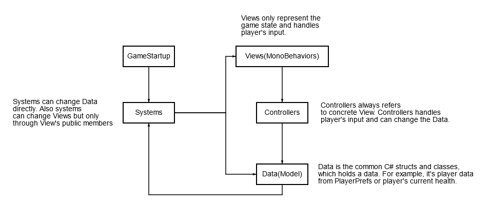

# Base Integridy Games Architecture #

## GameStartup ##

Содержит вызовы всех систем: IInitializeSystem, IUpdateSystem, IFixedUpdateSystem.

## Systems ##

Вместо вызовов стандартных Update-циклов Unity, в архитектуре используется 
набор кастомных циклов для обработки логики. 
Для создания цикла, необходимо реализовать один из интерфейсов:
 * IInitializeSystem
 * IUpdateSystem 
 * IFixedUpdateSystem.
 
Помимо этого нужно добавить систему в DI-Container вызовом статического метода 
`Container.BindUpdateSystem<TSystem>()`.

## Data(Models) ##

Классы для хранения данных приложения. Тоже добавляются в DI-Container.
Используются для работы систем. Могут меняться в системах и контроллерах.
Для создания реактивных полей используется класс `RxField<TField>`.

## Controllers ##

Аналогично Systems - слой для выполнения бизнес-логики, но зависимой от действий со стороны пользователя.
Каждый Controller должны ссылаться на экземпляр View.

## Views(MonoBehavior) ##

Стандартный MonoBehavior Unity, служит для отображения данных и перенаправления действий пользователя.
Не содержит в себе ничего, кроме логики отображения. Данные для отображения должны поступать из слоя Systems.